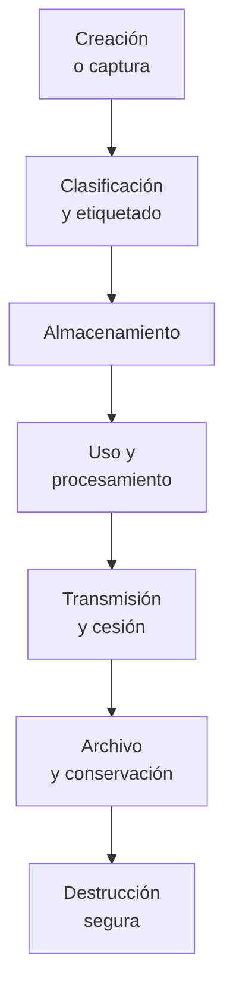
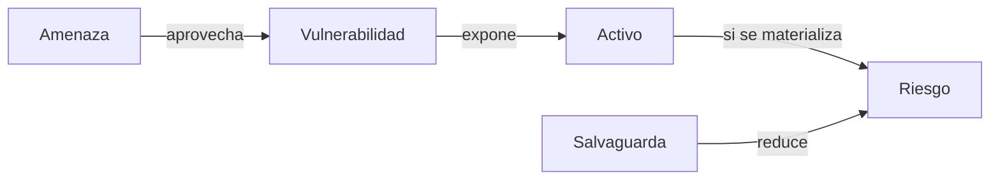
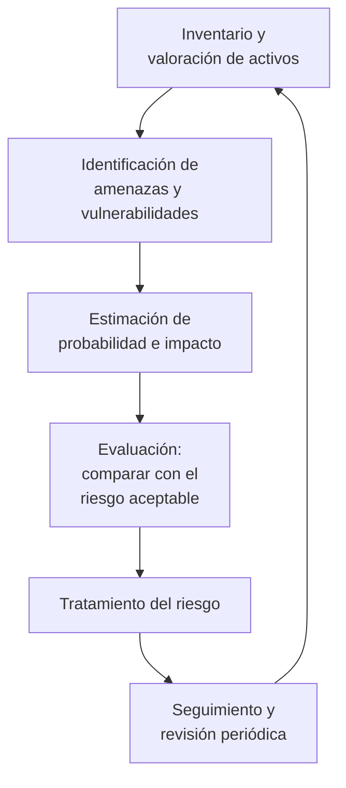
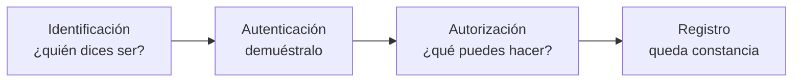
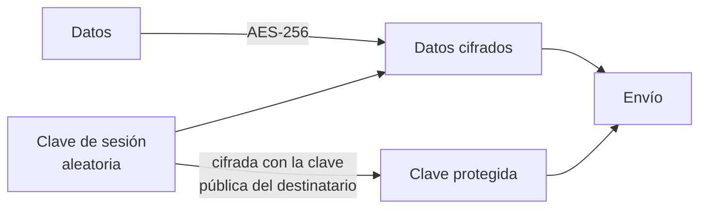
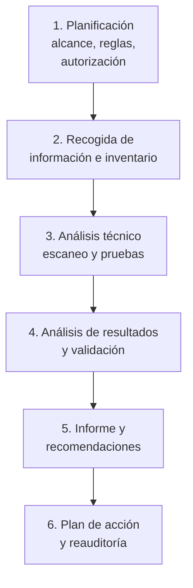
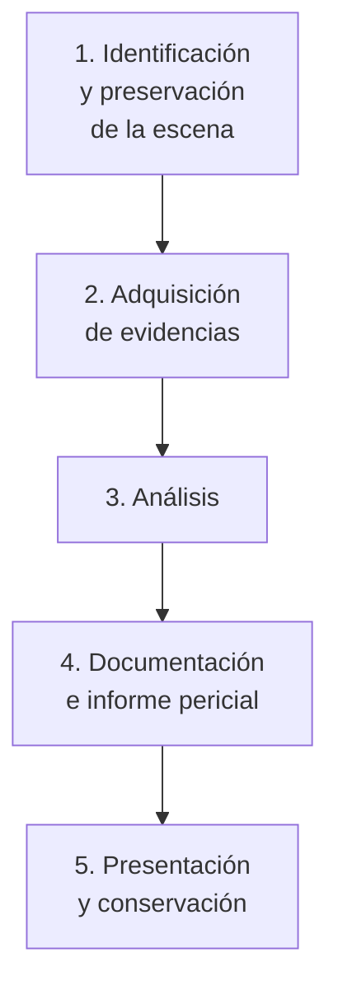

# Unidad 1. Fundamentos y pautas de seguridad informática

**Módulo 0378 — Seguridad y Alta Disponibilidad · CFGS Administración de Sistemas Informáticos en Red · Resultado de Aprendizaje 1**

2026-09-19 · @Someone

## Presentación de la unidad

Esta unidad desarrolla por completo el Resultado de Aprendizaje 1 del módulo 0378 y establece el vocabulario y los criterios que se reutilizan en las seis unidades restantes.

El módulo tiene una duración de 84 horas según la Orden de 19 de julio de 2010 (BOJA), que desarrolla en Andalucía el currículo del título fijado por el Real Decreto 1629/2009. La Unidad 1 corresponde al primer bloque de contenidos básicos, «Adopción de pautas y prácticas de tratamiento seguro de la información».

### Resultado de aprendizaje y criterios de evaluación

**RA1.** Adopta pautas y prácticas de tratamiento seguro de la información, reconociendo las vulnerabilidades de un sistema informático y la necesidad de asegurarlo.

| CE | Criterio de evaluación | Apartado del manual |
| --- | --- | --- |
| a | Se ha valorado la importancia de asegurar la privacidad, coherencia y disponibilidad de la información en los sistemas informáticos | 1.1, 1.2 |
| b | Se han descrito las diferencias entre seguridad física y lógica | 1.5, 1.6 |
| c | Se han clasificado las principales vulnerabilidades de un sistema informático, según su tipología y origen | 1.3, 1.4, 1.9 |
| d | Se ha contrastado la incidencia de las técnicas de ingeniería social en los fraudes informáticos | 1.4 |
| e | Se han adoptado políticas de contraseñas | 1.6 |
| f | Se han valorado las ventajas que supone la utilización de sistemas biométricos | 1.6 |
| g | Se han aplicado técnicas criptográficas en el almacenamiento y transmisión de la información | 1.7, 1.8 |
| h | Se ha reconocido la necesidad de establecer un plan integral de protección perimetral, especialmente en sistemas conectados a redes públicas | 1.3 (introducción; se desarrolla en las UT de cortafuegos y proxy) |
| i | Se han identificado las fases del análisis forense ante ataques a un sistema | 1.10 |

El criterio **h** solo se introduce aquí, al hablar de defensa en profundidad. Su desarrollo completo pertenece a los RA3, RA4 y RA5. Los apartados 1.3 y 1.9 incorporan además contenido de gestión del riesgo y auditoría que el currículo de 2009 no detalla, pero que hoy exigen el Esquema Nacional de Seguridad (RD 311/2022), el RGPD y la Directiva NIS2.

### Temporalización orientativa

Sobre una planificación de dos sesiones semanales de dos horas, la unidad ocupa **9 sesiones (18 horas)**, incluida la prueba de evaluación.

| Sesión | Contenido | Trabajo práctico |
| --- | --- | --- |
| 1 | 1.1 y 1.2 | Inventario y clasificación de activos del aula |
| 2 | 1.3 | Matriz de riesgo de un caso práctico |
| 3 | 1.4 | Búsqueda guiada en NVD, INCIBE y CCN-CERT |
| 4 | 1.5 | Visita o estudio del CPD del centro; cálculo de SAI |
| 5 | 1.6 | Usuarios, grupos, permisos y ACL en Ubuntu Server |
| 6 | 1.7 | GnuPG y verificación de sumas de comprobación |
| 7 | 1.8 | Copias con rsync/Borg e imagen de respaldo; restauración |
| 8 | 1.9 | Escaneo con Nmap y OpenVAS sobre Metasploitable 2 |
| 9 | 1.10 y evaluación | Adquisición de evidencias y cadena de custodia |

### Cómo usar este manual

Cada apartado sigue la misma estructura: concepto, aplicación práctica en un sistema real y punto de conexión con el laboratorio del módulo. Las tablas resumen sirven como material de consulta rápida durante las prácticas y la prueba escrita. Al final encontrarás las prácticas de laboratorio, un cuestionario de autoevaluación con soluciones, el glosario y las fuentes.

## 1.1. La información como activo

La información es el activo que da sentido a todos los demás: un servidor sin datos es reemplazable, unos datos perdidos casi nunca lo son. Proteger un sistema informático consiste, en el fondo, en proteger la información que crea, almacena, procesa y transmite.

### Sistemas de información y activos

Un **sistema de información** es el conjunto organizado de recursos que permite recoger, almacenar, procesar y distribuir información para cumplir los objetivos de una organización. No es solo tecnología: incluye procedimientos y personas.

Un **activo** es cualquier recurso del sistema que tiene valor para la organización y que, por tanto, merece protección. La metodología MAGERIT v3, de uso obligado en la Administración española, agrupa los activos en tipos. Esta clasificación es la que usaremos durante todo el módulo.

| Tipo de activo | Qué incluye | Ejemplo en el instituto |
| --- | --- | --- |
| Datos e información | Ficheros, bases de datos, copias de seguridad, registros | Expedientes de alumnado en Séneca, logs del cortafuegos |
| Servicios | Funciones que se prestan a usuarios internos o externos | Acceso a Internet del aula, servidor web, correo |
| Software | Sistemas operativos, aplicaciones, servicios de red | Ubuntu Server, Proxmox VE, OPNsense, Moodle |
| Hardware | Equipos, servidores, dispositivos de red y almacenamiento | Servidor del CPD, switches, portátiles del aula |
| Soportes de información | Medios donde reside la información | Discos, cintas, USB, NAS de copias |
| Redes y comunicaciones | Cableado, electrónica de red, enlaces, VLAN | Fibra del centro, VLAN de administración |
| Instalaciones | Espacios que albergan los equipos | Sala del CPD, armario rack del aula |
| Personal | Quien opera, administra o usa el sistema | Administrador del sistema, profesorado, alumnado |

El personal aparece en la lista por dos motivos: es un activo con conocimiento difícilmente reemplazable y, a la vez, el punto de entrada más habitual de los ataques (apartado 1.4).

### Valor de un activo

El valor no es el precio de compra. Un disco de 80 € puede contener la única copia de un trabajo de tres años. Para valorar un activo se estima el **perjuicio que causaría su pérdida, alteración o divulgación**, en varias dimensiones:

- Coste económico directo: reposición, horas de trabajo perdidas, lucro cesante.
- Coste legal: sanciones del RGPD, incumplimiento del ENS o de la NIS2.
- Coste reputacional: pérdida de confianza de usuarios, familias o clientes.
- Coste operativo: servicios que dejan de prestarse mientras dura la incidencia.

En la práctica se usa una escala cualitativa (muy bajo, bajo, medio, alto, muy alto) porque la cifra exacta rara vez es calculable. Lo importante es poder **ordenar** los activos: sin esa ordenación no se puede priorizar el gasto en seguridad.

### Clasificación de la información

Clasificar es etiquetar cada conjunto de información con el nivel de protección que necesita. Una organización pequeña suele bastarse con cuatro niveles.

| Nivel | Quién puede acceder | Ejemplos | Medidas mínimas |
| --- | --- | --- | --- |
| Pública | Cualquiera | Web del centro, oferta formativa | Control de integridad y disponibilidad |
| Uso interno | Miembros de la organización | Horarios, actas de departamento | Autenticación de usuario |
| Confidencial | Grupo autorizado concreto | Expedientes académicos, nóminas | Cifrado, control de acceso, registro de accesos |
| Restringida | Lista nominal y necesidad de conocer | Datos de salud, credenciales de administración | Cifrado, MFA, trazabilidad completa |

El RGPD añade una categoría propia, las **categorías especiales de datos personales** (salud, origen étnico, creencias, afiliación sindical, biometría, orientación sexual), que exigen medidas reforzadas con independencia de la etiqueta interna que se les ponga.

### Ciclo de vida de la información

Cada fase presenta riesgos distintos y exige controles distintos. La fase peor atendida suele ser la última: equipos que se retiran con los discos intactos.



| Fase | Riesgo principal | Control habitual |
| --- | --- | --- |
| Creación | Recoger más datos de los necesarios | Minimización (RGPD, art. 5) |
| Clasificación | No etiquetar y tratar todo igual | Política de clasificación |
| Almacenamiento | Acceso indebido, pérdida | Cifrado en reposo, permisos, copias |
| Uso | Copias descontroladas en equipos locales | Mínimo privilegio, DLP, registro |
| Transmisión | Interceptación | TLS, VPN, cifrado de extremo a extremo |
| Archivo | Soportes ilegibles u obsoletos | Migración de formato, verificación periódica |
| Destrucción | Recuperación de datos borrados | Borrado seguro, destrucción física certificada |

El borrado normal de un fichero solo elimina su referencia en el sistema de ficheros. Para eliminar información sensible hay que sobrescribir el soporte, usar el borrado criptográfico (destruir la clave de un disco cifrado) o destruirlo físicamente.

## 1.2. Principios de la seguridad

La seguridad de la información se evalúa sobre un conjunto reducido de propiedades. Las tres clásicas son confidencialidad, integridad y disponibilidad (la tríada **CID**, o CIA en inglés); el Esquema Nacional de Seguridad añade autenticidad y trazabilidad, y forma así las **cinco dimensiones de seguridad** con las que se categorizan los sistemas en España.

| Dimensión | Pregunta que responde | Mecanismo típico |
| --- | --- | --- |
| Confidencialidad (C) | ¿Solo lo ve quien debe? | Cifrado, permisos, ACL |
| Integridad (I) | ¿Está completo y sin alterar? | Funciones resumen, firma digital, RAID |
| Disponibilidad (D) | ¿Está accesible cuando se necesita? | Copias, redundancia, SAI, clúster |
| Autenticidad (A) | ¿Es quien dice ser? ¿Viene de donde dice? | Contraseñas, MFA, certificados |
| Trazabilidad (T) | ¿Quién hizo qué y cuándo? | Registros de auditoría, SIEM |

### Confidencialidad

Garantiza que la información solo sea accesible para quien está autorizado. Se rompe por acceso indebido, robo de soportes, interceptación del tráfico o publicación accidental. Se sostiene sobre dos pilares: control de acceso (apartado 1.6) y cifrado (apartado 1.7).

Un matiz importante: la confidencialidad también se pierde cuando alguien autorizado accede a información que no necesita para su trabajo. De ahí el principio de **necesidad de conocer**.

### Integridad

Garantiza que la información no ha sido modificada ni destruida de forma no autorizada, y que lo que se lee es lo que se escribió. Las amenazas no son solo maliciosas: un sector defectuoso, un corte eléctrico durante una escritura o un error humano dañan la integridad igual que un atacante.

Se verifica comparando funciones resumen (hash) antes y después, y se protege con firmas digitales, sistemas de ficheros con suma de comprobación como ZFS o Btrfs, transacciones en bases de datos y RAID.

### Disponibilidad

Garantiza que usuarios autorizados accedan a la información y a los servicios cuando los necesitan. Es la dimensión que da nombre a la segunda mitad del módulo. Se mide en porcentaje de tiempo de servicio anual.

| Nivel de disponibilidad | Tiempo de parada al año | Escenario habitual |
| --- | --- | --- |
| 99 % | 3 días 15 h | Servicio de aula sin redundancia |
| 99,9 % («tres nueves») | 8 h 46 min | Servidor con SAI y copias |
| 99,99 % («cuatro nueves») | 52 min | Clúster con conmutación por error |
| 99,999 % («cinco nueves») | 5 min | Infraestructura crítica redundada |

Cada nueve adicional multiplica el coste. Decidir cuántos se necesitan es una decisión de negocio, no técnica.

### Autenticidad, trazabilidad y no repudio

**Autenticidad** es la certeza sobre el origen: que el usuario es quien dice ser y que el mensaje procede de quien afirma haberlo enviado. Sin autenticidad, el control de acceso no sirve de nada.

**Trazabilidad** es la capacidad de reconstruir a posteriori quién hizo qué, cuándo y desde dónde. Exige registros fiables, sincronización horaria (NTP) y protección de los propios registros frente a manipulación. Es la base del análisis forense del apartado 1.10.

**No repudio** es la imposibilidad de negar una acción realizada. Es más fuerte que la trazabilidad: el registro puede rebatirse alegando manipulación, mientras que una firma digital con clave privada bajo control exclusivo del firmante no. Solo se consigue con criptografía asimétrica y una gestión de claves adecuada.

### Fiabilidad y privacidad

**Fiabilidad** es la probabilidad de que un sistema funcione correctamente durante un periodo determinado. Es un concepto de ingeniería, no de seguridad, pero condiciona la disponibilidad: se expresa con indicadores como el MTBF (tiempo medio entre fallos) y el MTTR (tiempo medio de reparación).

**Privacidad** es el derecho de las personas a controlar la información que les concierne. No es sinónimo de confidencialidad: un sistema puede ser perfectamente confidencial y vulnerar la privacidad si recoge datos que no necesita o los conserva más tiempo del permitido. El RGPD la articula en principios como minimización, limitación de la finalidad, limitación del plazo de conservación y protección de datos desde el diseño y por defecto.

### Cómo se rompe cada principio

| Situación | Principio comprometido |
| --- | --- |
| Un portátil sin cifrar se pierde en el tren | Confidencialidad |
| Un ransomware cifra el servidor de ficheros | Disponibilidad (e integridad) |
| Un alumno modifica una nota en la base de datos | Integridad |
| Un correo suplanta al director pidiendo una transferencia | Autenticidad |
| Se borran los logs tras una intrusión | Trazabilidad |
| Un administrador niega haber ejecutado un borrado | No repudio |
| Una encuesta pide el DNI sin necesitarlo | Privacidad |

## 1.3. Análisis del riesgo

No existe la seguridad total, y el presupuesto siempre es limitado. El análisis de riesgos es el método que permite decidir **dónde gastar primero**: identifica qué puede salir mal, cuánto costaría y qué medidas compensan su precio.

En España la referencia metodológica es **MAGERIT v3**, publicada por el Consejo Superior de Administración Electrónica, junto con la herramienta gratuita PILAR. En el ámbito internacional, las normas ISO/IEC 27001:2022 e ISO/IEC 27005 describen el mismo proceso.

### Los cuatro elementos básicos

| Elemento | Definición | Ejemplo |
| --- | --- | --- |
| Activo | Recurso con valor para la organización | Servidor de ficheros del centro |
| Amenaza | Suceso que puede causar un daño al activo | Incendio, ransomware, error humano |
| Vulnerabilidad | Debilidad del activo que la amenaza puede aprovechar | Sistema sin actualizar, sala sin detector de humo |
| Salvaguarda | Medida que reduce la probabilidad o el impacto | Parcheo mensual, extintor, copia fuera de sede |

La relación entre ellos es la clave del modelo: una amenaza solo produce daño si encuentra una vulnerabilidad, y las salvaguardas actúan reduciendo alguno de los dos factores del riesgo.



### Probabilidad, impacto y nivel de riesgo

El riesgo combina dos factores: la frecuencia con que se espera que ocurra la amenaza y el daño que causaría.

```latex
Riesgo = Probabilidad \times Impacto
```

El **impacto** se calcula a partir del valor del activo y de la degradación que sufriría (¿se pierde el 10 % o el 100 % de su valor?). La **probabilidad** se estima con datos históricos, informes sectoriales o juicio experto.

Se distinguen dos niveles de riesgo:

- **Riesgo intrínseco** (o inherente): el que existe antes de aplicar salvaguardas.
- **Riesgo residual**: el que queda después de aplicarlas. Nunca llega a cero; la dirección debe aceptarlo formalmente.

Una matriz cualitativa de 5×5 es suficiente en un entorno educativo o en una pyme:

| Probabilidad \\ Impacto | Muy bajo | Bajo | Medio | Alto | Muy alto |
| --- | --- | --- | --- | --- | --- |
| Muy alta | Bajo | Medio | Alto | Crítico | Crítico |
| Alta | Bajo | Medio | Alto | Alto | Crítico |
| Media | Muy bajo | Bajo | Medio | Alto | Alto |
| Baja | Muy bajo | Bajo | Bajo | Medio | Alto |
| Muy baja | Muy bajo | Muy bajo | Bajo | Bajo | Medio |

### El proceso de gestión del riesgo



El ciclo se cierra: el análisis de riesgos no es un documento que se redacta una vez, sino un proceso que se revisa al menos anualmente y siempre que haya un cambio relevante en el sistema.

### Tratamiento del riesgo

Ante cada riesgo que supere el umbral aceptable hay cuatro respuestas posibles, y solo cuatro.

| Opción | En qué consiste | Ejemplo |
| --- | --- | --- |
| Mitigar o reducir | Aplicar salvaguardas que bajen probabilidad o impacto | Instalar un SAI, cifrar los portátiles |
| Transferir o compartir | Trasladar la consecuencia económica a un tercero | Seguro de ciberriesgo, contrato con proveedor cloud |
| Evitar | Eliminar la actividad o el activo que genera el riesgo | Retirar un servicio heredado sin soporte |
| Aceptar | Asumir el riesgo de forma consciente y documentada | Asumir la parada de un servicio no crítico |

Aceptar un riesgo es una decisión legítima, pero debe estar **documentada y firmada** por quien tiene autoridad para asumirla. Lo que nunca es aceptable es ignorarlo.

### Dos principios que atraviesan todo el módulo

**Mínimo privilegio.** Cada usuario, proceso o sistema debe tener exactamente los permisos necesarios para su función, ni uno más, y solo durante el tiempo necesario. Reduce el daño de una cuenta comprometida y el de un error. Se materializa en no trabajar como `root`, usar `sudo` para acciones puntuales, separar cuentas de administración de las de uso diario y revisar permisos cuando alguien cambia de puesto.

**Defensa en profundidad.** Ningún control es infalible, así que se disponen varias capas independientes: si una falla, la siguiente contiene el ataque. Es la idea que explica por qué un sistema bien protegido tiene cortafuegos, actualizaciones, control de acceso, cifrado, copias y registros a la vez.

| Capa | Controles habituales |
| --- | --- |
| Física | Control de acceso al CPD, cerraduras de rack, videovigilancia |
| Perímetro | Cortafuegos, DMZ, proxy, filtrado de correo |
| Red interna | Segmentación en VLAN, IDS/IPS, cifrado del tráfico |
| Sistema | Actualizaciones, bastionado, antimalware, AppArmor o SELinux |
| Aplicación | Validación de entradas, gestión de sesiones, permisos |
| Datos | Cifrado, control de acceso, copias de seguridad |
| Personas | Formación, concienciación, procedimientos |

A estos dos se suman otros principios recogidos en el artículo 5 y siguientes del Esquema Nacional de Seguridad: seguridad integral, gestión continuada del riesgo, prevención-detección-respuesta-conservación, líneas de defensa, vigilancia continua y reevaluación periódica.

## 1.4. Amenazas y vulnerabilidades

Una **amenaza** es un suceso potencial que puede dañar un activo; una **vulnerabilidad** es la debilidad que permite que ese suceso tenga efecto. Las amenazas no se eliminan (nadie evita que haya tormentas ni atacantes), las vulnerabilidades sí.

### Clasificación de las amenazas por origen

| Origen | Descripción | Ejemplos |
| --- | --- | --- |
| Natural | Fenómenos ambientales sin intervención humana | Inundación, terremoto, rayo, ola de calor |
| Industrial o del entorno | Fallos de los servicios e instalaciones de soporte | Corte eléctrico, avería del aire acondicionado, incendio, fuga de agua |
| Errores y fallos no intencionados | Equivocaciones de usuarios, administradores o software | Borrado accidental, error de configuración, fallo de disco, bug |
| Ataques deliberados | Acciones intencionadas de personas | Malware, intrusión, denegación de servicio, robo, sabotaje |

La estadística es contraintuitiva para el alumnado: los errores no intencionados y los fallos de hardware causan más pérdidas de datos que los ataques, aunque estos últimos ocupen los titulares.

### Amenazas físicas y ambientales

Afectan al soporte material del sistema y se tratan a fondo en el apartado 1.5.

- Acceso físico no autorizado a equipos, racks o tomas de red.
- Robo o sustracción de equipos y soportes.
- Incendio, humo, inundación y humedad.
- Temperatura excesiva por fallo de climatización.
- Corte de suministro eléctrico, sobretensión y rayo.
- Interferencias electromagnéticas y daños al cableado.

### Amenazas lógicas

Afectan al software y a los datos. Se desarrollan en la UT de seguridad activa (RA2); aquí basta con identificarlas.

| Familia | Qué hace | Ejemplos |
| --- | --- | --- |
| Malware | Software con fines dañinos | Virus, troyanos, gusanos, spyware, rootkits |
| Ransomware | Cifra los datos y exige rescate | Doble extorsión: cifra y además publica los datos |
| Ataques a la disponibilidad | Saturan un servicio | DoS, DDoS, agotamiento de recursos |
| Interceptación | Escuchan o alteran comunicaciones | Sniffing, ataque de intermediario, suplantación de ARP |
| Ataques a credenciales | Obtienen o adivinan contraseñas | Fuerza bruta, diccionario, relleno de credenciales, keylogger |
| Ataques a aplicaciones web | Abusan de la lógica de la aplicación | Inyección SQL, XSS, control de acceso roto |
| Ingeniería social | Manipulan a las personas | Phishing, vishing, fraude del CEO |
| Amenaza interna | Abuso por parte de quien ya tiene acceso | Exfiltración por empleado, uso indebido de privilegios |

### Vulnerabilidades por tipo de activo

| Ámbito | Vulnerabilidades habituales |
| --- | --- |
| Hardware | Firmware o BIOS sin actualizar, ausencia de contraseña de BIOS, puertos USB sin control, fallos de diseño del procesador (Spectre, Meltdown), dispositivos sin soporte del fabricante |
| Software | Fallos de programación (desbordamiento de búfer, validación de entradas), versiones sin parchear, servicios innecesarios instalados, dependencias vulnerables de terceros |
| Redes | Protocolos sin cifrar (Telnet, FTP, HTTP), redes planas sin segmentar, Wi-Fi con cifrado débil, puertos abiertos innecesarios, ausencia de filtrado |
| Datos | Almacenamiento sin cifrar, permisos excesivos, copias de seguridad accesibles desde la red, datos de prueba con información real, ausencia de borrado seguro |
| Personas | Falta de formación, contraseñas reutilizadas, exceso de confianza, ausencia de procedimientos |

### Errores de configuración y software desactualizado

Estas dos causas explican la mayoría de los incidentes reales, y ninguna de las dos requiere que el atacante sea especialmente hábil.

**Errores de configuración típicos:**

- Credenciales por defecto sin cambiar (`admin/admin` en routers, impresoras, cámaras, paneles de administración).
- Servicios de administración expuestos a Internet (SSH, RDP, bases de datos).
- Permisos excesivos en ficheros y carpetas compartidas.
- Mensajes de error detallados que revelan rutas, versiones o consultas.
- Directorios listables, copias de seguridad accesibles por web.
- Registro desactivado o no revisado.

**Software desactualizado.** Entre la publicación de un parche y su aplicación existe una ventana de exposición. Los atacantes automatizan el análisis de esa ventana: muchas campañas empiezan pocas horas después de publicarse la prueba de concepto. Además, un sistema fuera de soporte (*end of life*) ya no recibe parches, por lo que sus vulnerabilidades son permanentes.

La respuesta organizativa es un **proceso de gestión de parches**: inventario, suscripción a avisos, evaluación, prueba en entorno controlado, despliegue y verificación, con plazos distintos según la criticidad.

### Ingeniería social y factor humano

La ingeniería social manipula a las personas para que revelen información o ejecuten acciones que comprometen la seguridad. No ataca la tecnología; la rodea. Resulta rentable porque no requiere vulnerabilidades técnicas y porque las defensas perimetrales no la detectan.

| Técnica | Canal | Descripción |
| --- | --- | --- |
| Phishing | Correo | Mensaje masivo que imita a una entidad legítima |
| Spear phishing | Correo | Versión dirigida, con datos reales de la víctima |
| Fraude del CEO (BEC) | Correo | Suplantación de un directivo para ordenar un pago |
| Vishing | Teléfono | Llamada que simula soporte técnico o banco |
| Smishing | SMS | Enlace fraudulento por mensaje corto |
| Pretexting | Cualquiera | Escenario inventado creíble para ganar confianza |
| Baiting | Físico | USB abandonado con malware |
| Tailgating | Físico | Colarse tras alguien autorizado por una puerta |
| Shoulder surfing | Físico | Observar la pantalla o el teclado ajeno |
| Dumpster diving | Físico | Buscar información en la basura |

Todas explotan los mismos resortes psicológicos: autoridad, urgencia, miedo, reciprocidad, escasez y prueba social. Un correo que dice «el director necesita esta transferencia antes de las 14:00» combina autoridad y urgencia deliberadamente.

Las contramedidas son organizativas más que técnicas: formación periódica con simulacros, procedimientos de verificación por un segundo canal para operaciones sensibles, política de mesa limpia y pantalla bloqueada, destrucción segura de documentación, y una cultura en la que comunicar un error no se penalice. Un usuario que avisa a los diez minutos de haber pinchado un enlace permite contener el incidente; uno que lo oculta por miedo, no.

### Fuentes de información sobre vulnerabilidades

Mantenerse informado es parte del trabajo del administrador. Estas son las fuentes de referencia.

| Fuente | Qué aporta | Enlace |
| --- | --- | --- |
| CVE Program | Identificador único por vulnerabilidad, con el formato CVE-AAAA-NNNN | [cve.org](https://www.cve.org/) |
| NVD (NIST) | Base de datos con puntuación CVSS, productos afectados y referencias | [nvd.nist.gov](https://nvd.nist.gov/) |
| CISA KEV | Catálogo de vulnerabilidades que se están explotando realmente | [cisa.gov/kev](https://www.cisa.gov/known-exploited-vulnerabilities-catalog) |
| INCIBE-CERT | Avisos en español para empresas y ciudadanía | [incibe.es](https://www.incibe.es/) |
| CCN-CERT | Alertas y guías CCN-STIC para el sector público español | [ccn-cert.cni.es](https://www.ccn-cert.cni.es/) |
| OWASP Top 10 | Categorías de riesgo más críticas en aplicaciones web | [owasp.org/Top10/2025](https://owasp.org/Top10/2025/es/) |
| Exploit-DB | Pruebas de concepto y exploits públicos | [exploit-db.com](https://www.exploit-db.com/) |
| Avisos del fabricante | Parches y boletines propios de cada producto | Ubuntu Security Notices, Debian Security Advisories, Microsoft, etc. |

La edición vigente del OWASP Top 10 es la de 2025, presentada en noviembre de ese año y cerrada en enero de 2026. Incorpora dos categorías nuevas, *Software Supply Chain Failures* y *Mishandling of Exceptional Conditions*, integra el SSRF dentro del control de acceso roto, y mantiene el control de acceso roto en primera posición.

### Medir la gravedad: CVSS

El **Common Vulnerability Scoring System** asigna a cada vulnerabilidad una puntuación de 0 a 10 a partir de métricas de explotabilidad e impacto. La versión vigente es CVSS v4.0, aunque muchos avisos siguen publicando también v3.1.

| Puntuación | Severidad |
| --- | --- |
| 0,0 | Ninguna |
| 0,1 – 3,9 | Baja |
| 4,0 – 6,9 | Media |
| 7,0 – 8,9 | Alta |
| 9,0 – 10,0 | Crítica |

La puntuación mide la gravedad técnica, no el riesgo para *tu* organización. Una vulnerabilidad crítica en un servicio que no tienes instalado es irrelevante; una vulnerabilidad media en el servidor que da servicio a todo el centro puede ser urgente. Esa traducción de gravedad a prioridad se explica en el apartado 1.9.

## 1.5. Seguridad física y ambiental

Quien tiene acceso físico a un equipo acaba teniendo acceso lógico. Con la máquina delante se puede arrancar desde un USB, extraer el disco, restablecer contraseñas o simplemente llevársela. Por eso la seguridad física es la primera capa de la defensa en profundidad: sin ella, las demás son decorativas.

|  | Seguridad física | Seguridad lógica |
| --- | --- | --- |
| Protege | Equipos, soportes, instalaciones, personas | Datos, software, servicios, identidades |
| Frente a | Robo, incendio, inundación, corte eléctrico, acceso presencial | Malware, intrusión remota, accesos indebidos, errores |
| Mecanismos | Cerraduras, CCTV, SAI, climatización, detección de incendios | Contraseñas, permisos, cifrado, cortafuegos, registros |
| Responsable habitual | Mantenimiento e infraestructura | Administración de sistemas |

### Protección del centro de proceso de datos

La elección del emplazamiento condiciona todo lo demás. Un CPD no debe situarse en sótanos inundables, en plantas bajas con fachada a la calle, junto a almacenes de material inflamable ni bajo aseos o cocinas por el riesgo de fuga de agua. Se prefieren plantas intermedias, sin ventanas exteriores o con ellas protegidas.

Medidas constructivas y de organización habituales:

- Puertas y paredes resistentes al fuego (RF-60 o superior) y sin acceso a través de falsos techos comunes.
- Suelo técnico elevado para cableado y distribución de aire, con detección de agua bajo él.
- Racks cerrados con llave y organización del cableado documentada y etiquetada.
- Separación de la sala de comunicaciones del almacén de material.
- Prohibición de almacenar cartón, papel o productos inflamables en la sala.
- Ausencia de conducciones de agua atravesando la sala.

En sistemas del sector público, el Esquema Nacional de Seguridad recoge estas medidas en el marco de protección de las instalaciones e infraestructuras (áreas separadas, control de accesos, acondicionamiento, energía eléctrica, protección frente a incendios e inundaciones).

### Control de acceso físico

Se organiza por perímetros concéntricos, de menor a mayor restricción: recinto del edificio, planta, sala técnica, rack. Cada perímetro exige una autorización distinta.

| Mecanismo | Qué aporta | Limitaciones |
| --- | --- | --- |
| Llave física | Coste nulo, sin dependencia eléctrica | No registra accesos, se copia, se pierde |
| Tarjeta de proximidad o PIN | Registro de accesos, revocación inmediata | Se presta o se sustrae |
| Biometría | Vinculada a la persona, no transferible | Coste, falsos rechazos, datos personales sensibles |
| Doble puerta (esclusa) | Evita el acceso por acompañamiento | Coste y espacio |
| Videovigilancia | Disuasión y prueba posterior | No impide el acceso; sujeta al RGPD |
| Registro de visitas | Trazabilidad de personal externo | Depende del cumplimiento humano |

Dos reglas prácticas: el personal externo (mantenimiento, operadoras, proveedores) debe ir siempre acompañado, y todo acceso a la sala técnica debe quedar registrado con identidad, fecha, hora y motivo. Los datos biométricos y las imágenes de videovigilancia son datos personales, y su tratamiento exige base jurídica, información a los afectados y plazos de conservación definidos.

### Condiciones ambientales

El calor y la humedad acortan la vida del hardware y provocan paradas. Los rangos recomendados por ASHRAE para salas de servidores son:

| Parámetro | Rango recomendado | Consecuencia si se incumple |
| --- | --- | --- |
| Temperatura | 18 – 27 °C | Apagado térmico, degradación de componentes |
| Humedad relativa | 40 – 60 % | Condensación (alta) o electricidad estática (baja) |
| Polvo | Filtrado, sala limpia | Obstrucción de ventiladores y disipadores |

La disposición en **pasillo frío y pasillo caliente** consiste en orientar todos los racks en el mismo sentido, de modo que las tomas de aire frío de los equipos den a un pasillo y las salidas de aire caliente a otro. Evita que un servidor aspire el aire caliente expulsado por el de enfrente y reduce notablemente el consumo de la climatización.

La climatización debe estar monitorizada y, en salas críticas, redundada: un solo equipo de aire acondicionado es un punto único de fallo tan grave como un solo servidor. Conviene instalar sondas de temperatura y humedad con alerta automática, y sensores de presencia de agua bajo el suelo técnico.

### Protección contra incendios

Un CPD combina tres elementos: material combustible, fuentes de calor y energía eléctrica. La protección se organiza en tres niveles.

1. **Prevención.** Instalación eléctrica revisada, ausencia de material combustible, prohibición de regletas encadenadas.
2. **Detección temprana.** Detectores ópticos de humo, y en salas críticas sistemas de aspiración que detectan partículas antes de que haya llama visible.
3. **Extinción.** Agentes limpios que no dañan la electrónica.

| Agente | Uso | Observaciones |
| --- | --- | --- |
| Gases inertes (IG-55, IG-541) y agentes limpios (HFC-227ea, Novec 1230) | Extinción automática en sala técnica | No conductores, no dejan residuo; exigen sala estanca y evacuación previa del personal |
| Extintor de CO₂ | Ataque manual a un conato | No deja residuo; riesgo de asfixia en espacio cerrado |
| Agua nebulizada | Salas grandes con instalación específica | Requiere diseño especializado |
| Agua a chorro o espuma | **Nunca** sobre equipo eléctrico | Conductora; destruye la electrónica |

El sistema de extinción debe integrarse con el corte automático de la climatización y, si procede, de la alimentación eléctrica.

### Sistemas de alimentación ininterrumpida

Un **SAI** (en inglés UPS) es un equipo que suministra energía desde baterías cuando falla la red eléctrica, y que además filtra las perturbaciones de la red. No está pensado para mantener el servicio durante horas, sino para permitir un **apagado ordenado** o para cubrir el arranque de un grupo electrógeno.

| Tipo | Funcionamiento | Tiempo de conmutación | Uso adecuado |
| --- | --- | --- | --- |
| Offline o standby | La carga va por red; conmuta a batería al fallar | 4 – 10 ms | Equipos de sobremesa |
| Línea interactiva | Añade regulador automático de tensión (AVR) | 2 – 4 ms | Pequeños servidores, electrónica de red |
| Online de doble conversión | La carga se alimenta siempre del inversor | 0 ms | CPD, servidores críticos |

El SAI protege frente a varias perturbaciones eléctricas: corte total, microcortes, bajadas de tensión sostenidas, sobretensiones, picos y ruido.

**Dimensionado.** Se suman las potencias de los equipos a proteger, se aplica un margen de crecimiento y se comprueba la autonomía necesaria:

```latex
P_{SAI} \ge 1{,}25 \times \sum P_{equipos}
```

Conviene distinguir potencia aparente (VA) de potencia activa (W): la relación entre ambas es el factor de potencia, típicamente 0,8–0,9 en los SAI actuales. Un SAI de 1.500 VA con factor 0,9 entrega 1.350 W.

**Gestión.** Un SAI sin software de gestión sirve de poco: hay que conectarlo por USB o red a los servidores y configurar un demonio (NUT en Linux, o el del fabricante) que ordene el apagado ordenado cuando la batería baje de un umbral. Las baterías tienen una vida útil de 3 a 5 años y deben probarse periódicamente: un SAI que nunca se ha probado no es una salvaguarda, es una suposición.

### Redundancia eléctrica y continuidad del suministro

Para servicios que no pueden pararse se escalan las medidas:

- **Doble acometida** eléctrica desde subestaciones distintas.
- **Grupo electrógeno** con depósito de combustible y arranque automático, que toma el relevo del SAI en minutos y permite autonomía de horas o días.
- **Doble vía de distribución** (A y B) con PDU independientes en el rack y fuentes de alimentación redundantes en cada servidor.
- **Pruebas periódicas** de conmutación: simulacros de corte programados, no solo revisiones documentales.

El grado de redundancia se describe habitualmente con los niveles Tier del Uptime Institute, de Tier I (sin redundancia) a Tier IV (tolerante a fallos, con vías activas duplicadas). Para un centro educativo, un SAI bien dimensionado, con baterías vigentes y apagado ordenado configurado, cubre la práctica totalidad de los incidentes reales.

## 1.6. Seguridad lógica y control de acceso

La seguridad lógica protege el software, los datos y los servicios mediante mecanismos del propio sistema. Su núcleo es el control de acceso, que se apoya en tres operaciones encadenadas.



| Operación | Pregunta | Ejemplo |
| --- | --- | --- |
| Identificación | ¿Quién eres? | Nombre de usuario, número de matrícula, DNI |
| Autenticación | ¿Puedes demostrarlo? | Contraseña, certificado, huella, código de un solo uso |
| Autorización | ¿Qué puedes hacer? | Permisos sobre ficheros, pertenencia a grupos, roles |
| Trazabilidad | ¿Qué hiciste? | Registro de sesión y de acciones privilegiadas |

### Factores de autenticación

| Factor | Fundamento | Ejemplos | Debilidad |
| --- | --- | --- | --- |
| Algo que sabes | Conocimiento | Contraseña, PIN, frase de paso | Se adivina, se comparte, se reutiliza |
| Algo que tienes | Posesión | Token, tarjeta, móvil, llave FIDO2 | Se pierde o se roba |
| Algo que eres | Característica física | Huella, iris, voz, rostro | No se puede cambiar si se compromete |

Hay dos factores complementarios de uso creciente: **dónde estás** (dirección IP, geolocalización) y **cómo te comportas** (patrón de escritura, horario habitual), que se emplean en autenticación adaptativa.

### Gestión de usuarios, grupos y permisos

En un sistema tipo Unix cada usuario tiene un UID, pertenece a un grupo principal y a grupos secundarios. Los permisos se asignan **siempre a grupos**, nunca a usuarios individuales: cuando alguien cambia de función, basta con cambiarlo de grupo.

```bash
# Crear un grupo y un usuario que pertenezca a él
sudo groupadd profesorado
sudo useradd -m -s /bin/bash -G profesorado jgarcia
sudo passwd jgarcia

# Añadir un usuario a un grupo secundario sin perder los anteriores
sudo usermod -aG sudo jgarcia

# Consultar identidad y grupos
id jgarcia
getent group profesorado

# Bloquear una cuenta al cesar la persona (mejor que borrarla de inmediato)
sudo usermod -L jgarcia
sudo usermod -s /usr/sbin/nologin jgarcia
```

Los permisos clásicos se expresan en tres tríadas (usuario propietario, grupo, otros) con tres bits cada una: lectura (`r`, 4), escritura (`w`, 2) y ejecución (`x`, 1).

| Notación | Significado sobre un fichero | Significado sobre un directorio |
| --- | --- | --- |
| `r` | Leer el contenido | Listar los nombres que contiene |
| `w` | Modificar el contenido | Crear y borrar entradas |
| `x` | Ejecutarlo | Atravesarlo y acceder a su contenido |

```bash
chmod 750 /srv/departamento      # rwx propietario, r-x grupo, nada otros
chmod g+s /srv/departamento      # los ficheros nuevos heredan el grupo
chown root:profesorado /srv/departamento
umask 027                        # permisos por defecto restrictivos
```

Tres bits especiales conviene conocerlos y vigilarlos: **SUID** (ejecuta con los privilegios del propietario), **SGID** (con los del grupo, y en directorios provoca herencia de grupo) y **sticky bit** (en `/tmp`, impide borrar ficheros ajenos). Un binario SUID propiedad de `root` mal programado es una vía directa de escalada de privilegios, de modo que conviene auditarlos:

```bash
sudo find / -perm -4000 -type f 2>/dev/null
```

### Listas de control de acceso

Cuando el modelo de tres tríadas se queda corto —por ejemplo, un directorio con permisos distintos para dos grupos— se usan las **ACL POSIX**, que permiten permisos por usuario y por grupo, y valores por defecto heredables.

```bash
# Permiso de lectura y escritura para un grupo concreto
sudo setfacl -m g:jefatura:rwx /srv/actas

# Herencia: lo que se cree dentro nacerá con esos permisos
sudo setfacl -d -m g:jefatura:rwx /srv/actas

# Consultar y eliminar
getfacl /srv/actas
sudo setfacl -x g:jefatura /srv/actas
```

Un `+` al final de los permisos en `ls -l` indica que ese objeto tiene ACL. En sistemas Windows el equivalente son las ACL de NTFS, con permisos básicos y avanzados, herencia y entradas de denegación explícita, que prevalecen sobre las de permiso.

Los modelos de control de acceso más habituales:

| Modelo | Quién decide | Uso típico |
| --- | --- | --- |
| DAC (discrecional) | El propietario del recurso | Permisos Unix y NTFS |
| MAC (obligatorio) | Una política central que el usuario no puede alterar | SELinux, AppArmor, sistemas militares |
| RBAC (basado en roles) | La pertenencia a un rol | Aplicaciones corporativas, directorios |
| ABAC (basado en atributos) | Reglas sobre atributos de usuario, recurso y contexto | Entornos cloud, acceso condicional |

### Políticas de contraseñas

Las recomendaciones actuales (NIST SP 800-63B, y en la misma línea las guías CCN-STIC) han cambiado respecto a lo que se enseñaba hace una década:

| Recomendado hoy | Desaconsejado |
| --- | --- |
| Longitud mínima de 12 caracteres, mejor frases de paso | Exigir mezcla obligatoria de cuatro tipos de carácter |
| Comprobar contra listas de contraseñas filtradas | Caducidad periódica forzada sin motivo |
| Permitir gestores de contraseñas y el pegado | Preguntas de recuperación («nombre de tu mascota») |
| Bloqueo temporal tras intentos fallidos | Pistas de contraseña visibles |
| Cambio inmediato solo si hay indicio de compromiso | Prohibir caracteres o limitar la longitud máxima |

La razón del cambio es empírica: la caducidad forzada lleva a variaciones predecibles (`Verano2026!` → `Otoño2026!`) y la complejidad obligatoria produce contraseñas difíciles de recordar pero fáciles de romper.

En Ubuntu Server la política se aplica con el módulo PAM `pam_pwquality`. El fichero de configuración se edita con vim:

```bash
sudo vim /etc/security/pwquality.conf
```

Dentro de vim: se pulsa `i` para entrar en modo inserción y escribir, `Esc` para volver al modo normal, y `:wq` seguido de Intro para guardar y salir (`:q!` sale descartando los cambios). Un contenido de partida razonable:

```
minlen = 12
difok = 3
dcredit = 0
ucredit = 0
lcredit = 0
ocredit = 0
retry = 3
dictcheck = 1
```

La caducidad y el historial se gestionan con `chage` y con `/etc/login.defs`:

```bash
sudo chage -l jgarcia              # ver la política de la cuenta
sudo chage -M 365 -W 14 jgarcia    # caducidad y aviso previo
```

### Autenticación multifactor y biometría

La **autenticación multifactor (MFA)** exige dos o más factores de categorías distintas. Dos contraseñas no son MFA; una contraseña más un código temporal, sí. Es la medida individual que más reduce el éxito de los ataques a credenciales, porque una contraseña robada deja de ser suficiente.

| Método | Seguridad | Comodidad | Observaciones |
| --- | --- | --- | --- |
| SMS | Baja | Alta | Vulnerable al duplicado de SIM; desaconsejado |
| TOTP (app autenticadora) | Media-alta | Media | Estándar abierto, funciona sin cobertura |
| Notificación push | Media | Alta | Riesgo de fatiga de notificaciones |
| Llave FIDO2 / WebAuthn | Alta | Media | Resistente al phishing por diseño |
| Certificado digital | Alta | Media | Requiere PKI y gestión del ciclo de vida |

En Linux, el acceso por SSH con MFA se configura con `libpam-google-authenticator`; el acceso con clave pública más frase de paso ya constituye de hecho dos factores.

**Sistemas biométricos.** Su ventaja es que no se prestan ni se olvidan. Sus límites hay que conocerlos bien:

- **Tasa de falsa aceptación (FAR)**: proporción de impostores admitidos. Es el error grave en seguridad.
- **Tasa de falso rechazo (FRR)**: proporción de usuarios legítimos rechazados. Es el error que genera quejas.
- **Punto de equilibrio (EER)**: umbral donde ambas coinciden; sirve para comparar sistemas.

Ajustar el umbral para bajar el FAR sube inevitablemente el FRR. Además, un rasgo biométrico comprometido no se puede cambiar, por lo que nunca debe almacenarse la imagen original sino una plantilla matemática cifrada, preferiblemente en hardware seguro del propio dispositivo. Los datos biométricos usados para identificar unívocamente a una persona son categoría especial en el RGPD (art. 9), lo que exige justificación reforzada: en un centro educativo, sustituir el carné por la huella dactilar rara vez supera el juicio de proporcionalidad.

### Gestión de privilegios y cuentas administrativas

La cuenta de administrador es el objetivo prioritario de cualquier atacante. Reglas de trabajo:

1. **No usar `root` para el trabajo diario.** Cada administrador usa su cuenta nominal y eleva privilegios con `sudo` solo cuando los necesita. Así cada acción queda atribuida a una persona.
2. **Cuentas separadas.** Una cuenta para la administración y otra para navegar o leer correo, nunca la misma.
3. **Privilegios acotados.** `sudo` permite autorizar órdenes concretas en lugar de acceso total:

   ```
   %operadores ALL=(root) /usr/bin/systemctl restart apache2
   ```

   Este fichero se edita **siempre** con `sudo visudo`, que valida la sintaxis antes de guardar y evita dejar el sistema sin administración por un error tipográfico.
4. **Revisión periódica.** Auditar trimestralmente quién pertenece a los grupos privilegiados y retirar los accesos de quien ya no los necesita.
5. **Cuenta de emergencia.** Una credencial de último recurso, con contraseña larga guardada en sobre sellado o caja fuerte, cuyo uso genere alerta automática.
6. **Registro protegido.** Los comandos ejecutados con `sudo` quedan en `/var/log/auth.log`; en entornos exigentes se envían a un servidor de registro externo para que un atacante con privilegios no pueda borrarlos.

Un indicador sencillo de madurez: si en una organización todo el mundo conoce la contraseña de `root`, no hay control de acceso, hay una costumbre.

## 1.7. Introducción a la criptografía

La criptografía es la herramienta que permite proteger la información incluso cuando el atacante tiene acceso a ella. Un disco cifrado robado no revela nada; un fichero firmado delata cualquier alteración.

Tres reglas de partida:

- La seguridad reside en la **clave**, nunca en el secreto del algoritmo (principio de Kerckhoffs). Los algoritmos son públicos y han resistido años de análisis.
- **Nunca se inventan algoritmos propios.** Se usan implementaciones auditadas: OpenSSL, GnuPG, libsodium.
- Cifrar mal es peor que no cifrar, porque genera una falsa sensación de protección.

### Cifrado simétrico

La misma clave cifra y descifra. Es rápido y adecuado para grandes volúmenes de datos.

| Aspecto | Detalle |
| --- | --- |
| Algoritmos actuales | AES (128, 192 o 256 bits), ChaCha20 |
| Algoritmos obsoletos | DES, 3DES, RC4 — no deben usarse |
| Modos de operación | GCM y ChaCha20-Poly1305 (cifrado autenticado, recomendados); CBC exige HMAC aparte; ECB **nunca** |
| Ventaja | Muy rápido, admite aceleración por hardware (AES-NI) |
| Problema | Distribuir la clave de forma segura entre las partes |

```bash
# Cifrar un fichero con contraseña (AES-256)
gpg --symmetric --cipher-algo AES256 informe.pdf

# Descifrar
gpg --decrypt informe.pdf.gpg > informe.pdf
```

### Cifrado asimétrico

Cada participante tiene un par de claves matemáticamente relacionadas: la **pública**, que se difunde, y la **privada**, que jamás sale de su poder. Lo que cifra una solo lo descifra la otra.

| Objetivo | Se cifra con | Se descifra con |
| --- | --- | --- |
| Confidencialidad | Clave **pública** del destinatario | Clave **privada** del destinatario |
| Autenticidad y no repudio (firma) | Clave **privada** del emisor | Clave **pública** del emisor |

Algoritmos vigentes: RSA con al menos 3072 bits, y criptografía de curva elíptica (Ed25519 para firma, X25519 para intercambio de claves, ECDSA P-256), que ofrece seguridad equivalente con claves mucho más cortas.

Es entre 100 y 1.000 veces más lento que el simétrico, así que en la práctica se combinan ambos en un **esquema híbrido**: se genera una clave simétrica aleatoria de sesión, se cifran con ella los datos, y se cifra solo esa clave con la clave pública del destinatario. Así funcionan TLS, GnuPG y S/MIME.



### Funciones resumen y control de integridad

Una **función resumen** (hash) transforma una entrada de cualquier tamaño en una cadena de longitud fija. Sus propiedades: es determinista, rápida de calcular, imposible de invertir en la práctica, y un cambio mínimo en la entrada altera por completo la salida (efecto avalancha).

| Algoritmo | Estado | Uso |
| --- | --- | --- |
| MD5 | Roto | Solo detección de errores accidentales; nunca seguridad |
| SHA-1 | Roto | En retirada; no usar |
| SHA-256 / SHA-512 | Vigente | Integridad, firma, certificados |
| SHA-3, BLAKE2 | Vigente | Alternativas modernas |
| bcrypt, scrypt, Argon2 | Vigente | **Solo** para almacenar contraseñas |

La última fila es importante: las contraseñas no se guardan con SHA-256 a secas. Se usan funciones deliberadamente lentas y con *salt* aleatorio por usuario, para que probar millones de combinaciones resulte costoso. En Linux, `/etc/shadow` almacena el resultado con el algoritmo indicado por un prefijo (`$y$` para yescrypt, `$6$` para SHA-512-crypt).

```bash
# Verificar la integridad de una descarga
sha256sum ubuntu-24.04-live-server-amd64.iso
sha256sum -c SHA256SUMS
```

Cuando además de integridad se necesita autenticidad del origen sin criptografía asimétrica, se usa **HMAC**: un resumen que incorpora una clave secreta compartida.

### Firma digital

Combina resumen y cifrado asimétrico: se calcula el hash del documento y se cifra ese hash con la clave privada del firmante. Cualquiera puede recalcular el hash, descifrar la firma con la clave pública y comparar.

Aporta integridad, autenticidad y no repudio, pero **no confidencialidad**: un documento firmado sigue siendo legible. Para que además sea secreto hay que cifrarlo.

La confianza en que una clave pública pertenece realmente a quien dice se resuelve de dos formas: mediante una **infraestructura de clave pública (PKI)**, donde una autoridad de certificación emite certificados X.509 (es el modelo de TLS y del DNI electrónico), o mediante una **red de confianza**, donde los usuarios firman mutuamente sus claves (modelo de PGP).

### Protección de datos almacenados y transmitidos

**En reposo (datos almacenados):**

| Ámbito | Herramienta | Nota |
| --- | --- | --- |
| Disco completo | LUKS/dm-crypt (Linux), BitLocker (Windows), FileVault (macOS) | Protege frente a robo del equipo o del disco |
| Fichero o carpeta | GnuPG, age, VeraCrypt | Protege también frente a otros usuarios del sistema |
| Copias de seguridad | Cifrado del propio software de copia | Imprescindible si salen de la organización |
| Bases de datos | Cifrado transparente o cifrado por columna | Para campos sensibles concretos |

```bash
# Cifrar una partición con LUKS
sudo cryptsetup luksFormat /dev/sdb1
sudo cryptsetup open /dev/sdb1 datos_seguros
sudo mkfs.ext4 /dev/mapper/datos_seguros
```

El cifrado de disco completo protege el equipo **apagado**. Con el sistema arrancado y la unidad montada, los ficheros son accesibles según los permisos normales: no sustituye al control de acceso.

**En tránsito (datos transmitidos):**

| Protocolo inseguro | Sustituto |
| --- | --- |
| HTTP | HTTPS (TLS 1.3, o 1.2 como mínimo) |
| FTP, Telnet | SFTP, SCP, SSH |
| SMTP, POP3, IMAP en claro | Con STARTTLS o sobre TLS |
| LDAP | LDAPS o LDAP con StartTLS |
| Red no confiable | VPN con WireGuard, OpenVPN o IPsec |

### Gestión básica de claves

El punto débil de cualquier sistema criptográfico no suele ser el algoritmo, sino la gestión de las claves. Ciclo de vida:

1. **Generación** con un generador de números aleatorios criptográficamente seguro y longitud adecuada.
2. **Distribución** por un canal seguro, o evitándola mediante criptografía asimétrica.
3. **Almacenamiento** protegido: nunca en el código fuente ni en un repositorio; en gestores de secretos, HSM o TPM; las claves privadas, siempre protegidas con frase de paso.
4. **Uso** limitado a su finalidad: una clave, un propósito.
5. **Rotación** periódica y renovación antes de la caducidad.
6. **Revocación** inmediata ante sospecha de compromiso, con publicación de la revocación.
7. **Destrucción** segura de las claves retiradas.

Dos consecuencias prácticas. Primera: hay que **generar y guardar el certificado de revocación** en el momento de crear un par de claves GnuPG, porque sin él no se puede anular una clave privada perdida. Segunda: si se cifra información y se pierde la clave, la información está perdida; cualquier esquema de cifrado debe incluir un procedimiento de custodia o recuperación de claves aprobado.

```bash
gpg --full-generate-key            # generar un par de claves
gpg --export --armor usuario@centro.es > clave_publica.asc
gpg --output revocacion.asc --gen-revoke usuario@centro.es
```

### Una nota sobre criptografía poscuántica

Los ordenadores cuánticos de capacidad suficiente romperían RSA y la criptografía de curva elíptica. El NIST publicó en 2024 los primeros estándares resistentes (ML-KEM para intercambio de claves y ML-DSA para firma), y navegadores y bibliotecas ya despliegan esquemas híbridos. El riesgo relevante hoy es el llamado *harvest now, decrypt later*: capturar tráfico cifrado ahora para descifrarlo dentro de años. Afecta a información cuya confidencialidad deba durar más de una década.

## 1.8. Almacenamiento, copias y recuperación

Este apartado es el más práctico de la unidad y el que más peso tiene en la evaluación del RA1. La idea que lo resume: **una copia de seguridad no existe hasta que se ha restaurado con éxito.**

### Políticas de almacenamiento seguro

Centralizar el almacenamiento tiene ventajas claras frente a dejar que cada usuario guarde en su equipo: permite aplicar una política única de permisos, copiar todo desde un solo punto, controlar el crecimiento y evitar duplicados descontrolados. Su contrapartida es que concentra el riesgo, y por eso exige redundancia y copias.

| Arquitectura | Qué es | Uso típico |
| --- | --- | --- |
| DAS | Almacenamiento conectado directamente al servidor | Servidor único, discos internos |
| NAS | Cabina conectada por red que sirve ficheros (SMB, NFS) | Carpetas compartidas del centro, destino de copias |
| SAN | Red dedicada que sirve bloques (iSCSI, Fibre Channel) | Virtualización, bases de datos |
| Objeto / nube | Almacenamiento por API (S3 y compatibles) | Copias externas, archivo a largo plazo |

**RAID** combina varios discos para ganar rendimiento, tolerancia a fallos o ambos.

| Nivel | Mínimo de discos | Tolerancia | Capacidad útil | Comentario |
| --- | --- | --- | --- | --- |
| RAID 0 | 2 | Ninguna | 100 % | Solo rendimiento; un fallo lo pierde todo |
| RAID 1 | 2 | 1 disco | 50 % | Espejo; sencillo y seguro |
| RAID 5 | 3 | 1 disco | n−1 discos | Paridad distribuida; reconstrucción lenta y arriesgada en discos grandes |
| RAID 6 | 4 | 2 discos | n−2 discos | Recomendado sobre RAID 5 en cabinas actuales |
| RAID 10 | 4 | 1 por espejo | 50 % | Mejor rendimiento y reconstrucción; el más usado en servidores |

Advertencia esencial: **RAID no es una copia de seguridad.** Protege frente al fallo físico de un disco, pero no frente a un borrado accidental, un cifrado por ransomware, un error de aplicación o un incendio. Todo lo que se escribe mal se escribe mal en todos los discos a la vez.

Otras pautas de almacenamiento seguro: cifrar los soportes extraíbles, llevar inventario de los soportes y su ubicación, controlar el uso de USB en equipos críticos, y aplicar borrado seguro o destrucción física antes de dar de baja cualquier disco.

### Dos parámetros que definen la política: RPO y RTO

| Parámetro | Qué mide | Pregunta que responde |
| --- | --- | --- |
| RPO (*Recovery Point Objective*) | Cantidad máxima de datos que se acepta perder, medida en tiempo | ¿Cada cuánto hay que copiar? |
| RTO (*Recovery Time Objective*) | Tiempo máximo aceptable de interrupción | ¿Cómo de rápido hay que poder restaurar? |

Un RPO de 24 horas significa copia diaria y asumir la pérdida de, como mucho, un día de trabajo. Un RTO de 4 horas descarta restaurar 2 TB desde cinta por la red. Ambos parámetros los fija quien asume el riesgo, no quien administra el sistema, y de ellos se deriva todo lo demás.

### Tipos de copia de seguridad

| Tipo | Qué copia | Ventana de copia | Restauración | Espacio |
| --- | --- | --- | --- | --- |
| Completa | Todos los datos seleccionados | Larga | Un solo juego | Mucho |
| Diferencial | Lo cambiado desde la última **completa** | Media, creciente | Completa + última diferencial | Medio |
| Incremental | Lo cambiado desde la **última copia** de cualquier tipo | Corta | Completa + todas las incrementales en orden | Poco |
| Incremental sintética | Incrementales que el software consolida en una completa | Corta | Como una completa | Poco-medio |
| Espejo | Réplica exacta del origen | Corta | Inmediata | Igual al origen |

La elección es un compromiso: la incremental ocupa menos y se hace más rápido, pero la restauración depende de que **toda** la cadena esté íntegra; si falta un eslabón, se pierde todo lo posterior. La diferencial es más segura de restaurar y más costosa de mantener.

Un esquema semanal habitual: completa el viernes por la noche, incrementales de lunes a jueves.

### Estrategias de rotación y retención

| Esquema | Funcionamiento | Uso |
| --- | --- | --- |
| Abuelo-padre-hijo | Copias diarias (hijo), semanales (padre) y mensuales (abuelo), con retenciones distintas | El más extendido |
| Torre de Hanói | Rotación matemática que maximiza la cobertura temporal con pocos soportes | Entornos con soportes limitados |
| Retención por niveles (GFS ampliado) | 7 diarias, 4 semanales, 12 mensuales, 3 anuales | Cumplimiento normativo |

La retención debe responder a dos exigencias contrapuestas: conservar lo suficiente para recuperarse de un problema detectado tarde (un ransomware puede estar latente semanas), y no conservar datos personales más tiempo del necesario, como exige el RGPD.

### La regla 3-2-1 y las copias desconectadas

La **regla 3-2-1** es el mínimo profesional:

- **3** copias de los datos (el original y dos copias).
- En **2** tipos de soporte distintos (por ejemplo, disco y cinta, o disco y nube).
- Con **1** copia fuera de las instalaciones.

La evolución frente al ransomware es la **regla 3-2-1-1-0**, que añade:

- **1** copia desconectada, inmutable o con air gap.
- **0** errores en las verificaciones de restauración.

Una **copia desconectada** (*offline*) no es accesible desde la red en condiciones normales: un disco externo que se guarda desconectado en caja fuerte, una cinta en armario ignífugo, o un repositorio con inmutabilidad temporal (WORM, *object lock*) que impide borrar o modificar hasta que expire el plazo. Es la única defensa realmente eficaz contra un atacante que obtiene privilegios de administración: lo primero que hace un ransomware moderno es buscar y destruir las copias accesibles en red.

Cuidado con las carpetas sincronizadas en la nube: no son copias de seguridad. Si un fichero se cifra o se borra en el equipo, el cambio se propaga. Solo lo son si el servicio ofrece versionado y retención configurables.

### Imágenes de respaldo

Una **imagen** es una copia del contenido completo de un disco o partición, incluidos el sector de arranque, la tabla de particiones, el sistema operativo, las aplicaciones y la configuración. Se distingue de la copia de ficheros en que restaura un sistema **arrancable**, no solo los datos.

| Aspecto | Imagen | Copia de ficheros |
| --- | --- | --- |
| Restaura | El sistema entero | Datos seleccionados |
| Tiempo de recuperación tras desastre | Corto | Largo (reinstalar y reconfigurar) |
| Restauración de un fichero suelto | Requiere montar la imagen | Inmediata |
| Uso típico | Clonar aulas, recuperar servidores, punto previo a un cambio | Datos de usuario, bases de datos |

Herramientas habituales:

- **Clonezilla**: clonado e imagen de equipos físicos, con despliegue multitarjeta por red para aulas completas.
- **`dd`**: copia bloque a bloque, de bajo nivel. Muy potente y muy peligrosa: invertir origen y destino destruye el disco bueno.
- **vzdump / Proxmox Backup Server**: copia de máquinas virtuales y contenedores del laboratorio, con deduplicación e incrementales.
- **Windows**: imagen del sistema, y en entornos gestionados MDT o WDS.

```bash
# Imagen comprimida de un disco completo (comprobar antes con lsblk)
sudo dd if=/dev/sda bs=4M status=progress | gzip -c > /mnt/copias/sistema.img.gz

# Copia de una máquina virtual en Proxmox
vzdump 101 --mode snapshot --compress zstd --storage copias
```

En el laboratorio virtualizado del módulo, las instantáneas (*snapshots*) permiten volver atrás tras una práctica destructiva. No son copias de seguridad: dependen del mismo almacenamiento y del mismo hipervisor que la máquina original.

### Cifrado y protección de las copias

Una copia concentra toda la información de la organización en un único soporte fácil de transportar. Por eso debe protegerse al menos tanto como el original:

- Cifrar siempre las copias que salen de las instalaciones o se alojan en la nube.
- Custodiar la clave de cifrado **fuera** del sistema de copias; si la clave solo está en el servidor que ha ardido, la copia es papel mojado.
- Restringir el acceso al repositorio con cuentas propias, distintas de las de administración del sistema origen.
- Registrar todo acceso y toda operación de borrado sobre el repositorio.

```bash
# Copia incremental cifrada y deduplicada con Borg
borg init --encryption=repokey /mnt/copias/repo
borg create --stats --compression zstd /mnt/copias/repo::{hostname}-{now} /srv /etc /home
borg prune --keep-daily=7 --keep-weekly=4 --keep-monthly=12 /mnt/copias/repo
```

### Restauración y verificación

El error más común y más caro es dar por buena una copia que nunca se ha probado. Los motivos de fallo son frecuentes: el trabajo terminaba con error y nadie leía el aviso, se copiaba un directorio equivocado, la base de datos se copió en caliente y quedó inconsistente, o el soporte está ilegible.

Un procedimiento de verificación completo incluye:

1. **Comprobación automática** tras cada trabajo: código de salida, registro y suma de comprobación.
2. **Monitorización y alerta** ante cualquier trabajo fallido o no ejecutado.
3. **Prueba de restauración parcial** mensual: recuperar algunos ficheros al azar y comparar con el original.
4. **Prueba de restauración completa** anual o semestral, en un entorno aislado (el laboratorio virtual sirve perfectamente), midiendo el tiempo real de recuperación.
5. **Comparación con el RTO y el RPO** comprometidos, y ajuste de la política si no se cumplen.
6. **Documentación** del procedimiento de restauración, accesible **también** cuando el sistema esté caído. Una guía de recuperación guardada únicamente en el servidor que hay que recuperar no sirve de nada.

```bash
# Listar y verificar un repositorio Borg
borg list /mnt/copias/repo
borg check --verify-data /mnt/copias/repo

# Restauración de prueba a un directorio temporal
mkdir -p /tmp/prueba && cd /tmp/prueba
borg extract /mnt/copias/repo::servidor-2026-09-19 etc/passwd
```

Toda esta política se documenta por escrito: qué se copia, con qué frecuencia, dónde se guarda, cuánto se conserva, quién es responsable, cómo se verifica y cómo se restaura. Ese documento es una de las evidencias que solicita cualquier auditoría, y forma parte del plan de continuidad de negocio.

## 1.9. Auditoría y análisis de vulnerabilidades

Una **auditoría de seguridad** es la revisión sistemática de un sistema para comprobar si cumple una política, una norma o un nivel de seguridad esperado. No es un ataque ni una demostración de habilidad: es un proceso documentado que termina en un informe con recomendaciones priorizadas.

> **Antes de nada: autorización.** Escanear o auditar un sistema sin permiso expreso y por escrito del titular es un delito tipificado en el Código Penal (arts. 197 bis y 264 y siguientes). La autorización debe indicar alcance, direcciones IP, fechas, horarios y persona de contacto. En el módulo, todas las prácticas se realizan exclusivamente sobre las máquinas del laboratorio virtual.

### Objetivos y tipos

| Objetivo | Qué busca |
| --- | --- |
| Verificar cumplimiento | Comprobar la adecuación al ENS, ISO 27001, RGPD o política interna |
| Detectar vulnerabilidades técnicas | Identificar fallos explotables antes de que lo haga un atacante |
| Validar los controles | Comprobar que las salvaguardas funcionan realmente |
| Aportar evidencias | Documentar el estado de seguridad ante dirección o terceros |

| Criterio | Tipos |
| --- | --- |
| Quién la realiza | Interna (personal propio) o externa (tercero independiente) |
| Conocimiento previo | Caja blanca (acceso total a documentación y credenciales), caja negra (sin información) o caja gris (información parcial) |
| Alcance | Técnica de sistemas, de aplicaciones web, de red, física, de cumplimiento normativo |
| Profundidad | Análisis de vulnerabilidades (detecta) o test de intrusión (además explota) |

La diferencia entre análisis de vulnerabilidades y test de intrusión importa: el primero es automatizable, periódico y barato; el segundo es manual, puntual, caro y demuestra impacto real.

### Fases de una auditoría



1. **Planificación.** Se define el alcance, los sistemas incluidos y excluidos, las ventanas horarias, el nivel de intrusividad permitido y los contactos de emergencia. Se firma la autorización.
2. **Recogida de información.** Inventario de activos, arquitectura de red, versiones, servicios expuestos, documentación existente. En auditorías externas, esta fase incluye reconocimiento pasivo (registros DNS, información pública).
3. **Análisis técnico.** Escaneo de red y de vulnerabilidades, revisión de configuraciones, pruebas de contraseñas débiles, revisión de permisos y registros.
4. **Análisis de resultados.** Eliminación de falsos positivos, verificación manual de los hallazgos relevantes y determinación del impacto real en el contexto de la organización.
5. **Informe.** Documento con los hallazgos, su gravedad, la evidencia y las recomendaciones concretas.
6. **Plan de acción y reauditoría.** Corrección con responsables y plazos, y nueva comprobación de que los hallazgos se han resuelto.

### Inventario de activos

No se puede proteger lo que no se sabe que existe. El inventario es el punto de partida de la auditoría y del análisis de riesgos, y debe mantenerse vivo. Campos mínimos:

| Campo | Ejemplo |
| --- | --- |
| Identificador | SRV-CPD-03 |
| Tipo | Servidor virtual |
| Ubicación | CPD, nodo Proxmox 1 |
| Responsable | Departamento de Informática |
| Sistema y versión | Ubuntu Server 24.04 LTS |
| Servicios que presta | Servidor web interno, LDAP |
| Criticidad | Alta |
| Dimensiones afectadas | C: media · I: alta · D: alta |
| Fecha de alta y de fin de soporte | 09/2025 – 04/2029 |

El descubrimiento puede automatizarse con escaneo de red, con herramientas de inventario como GLPI o OCS Inventory, o con los propios agentes de gestión. Lo que ninguna herramienta resuelve es la asignación de responsable y criticidad: eso es una decisión de la organización.

### Escaneo y clasificación de vulnerabilidades

| Herramienta | Para qué sirve |
| --- | --- |
| Nmap | Descubrimiento de equipos, puertos, servicios y versiones |
| Greenbone / OpenVAS | Escáner de vulnerabilidades libre, con base de pruebas actualizable |
| Nessus Essentials | Escáner comercial con versión gratuita limitada |
| Lynis | Auditoría de bastionado del propio sistema Linux |
| CIS-CAT / benchmarks CIS | Comprobación de la configuración frente a guías de referencia |
| Nikto, OWASP ZAP | Análisis de servidores y aplicaciones web |
| Wazuh | Detección continua de vulnerabilidades y desviaciones de configuración |

```bash
# Descubrimiento de equipos activos en la red del laboratorio
nmap -sn 192.168.100.0/24

# Puertos, servicios y versiones de un objetivo autorizado
sudo nmap -sS -sV -O -p- 192.168.100.20

# Scripts de detección de vulnerabilidades conocidas
nmap --script vuln 192.168.100.20

# Auditoría de bastionado del propio servidor
sudo lynis audit system
```

Cada hallazgo se clasifica por su identificador CVE cuando lo tiene, y por su puntuación CVSS (apartado 1.4). Hay que validar siempre: los escáneres generan **falsos positivos** (informan de algo que no existe, a menudo por deducir la vulnerabilidad de un número de versión) y **falsos negativos** (no detectan lo que sí existe).

### Priorización

La puntuación CVSS por sí sola no basta para decidir el orden de corrección. Un criterio operativo combina cuatro factores:

1. **Gravedad técnica** (CVSS).
2. **Criticidad del activo** afectado según el inventario.
3. **Exposición**: ¿es accesible desde Internet, desde la red interna o solo localmente?
4. **Explotación real**: ¿existe exploit público? ¿aparece en el catálogo KEV de CISA?

Una vulnerabilidad de CVSS 7,5 en un servicio publicado en Internet y con exploit público es más urgente que una de 9,1 en un equipo aislado del laboratorio. Ese razonamiento, y no la lista ordenada que devuelve la herramienta, es lo que se espera de un técnico.

| Prioridad | Criterio orientativo | Plazo de corrección |
| --- | --- | --- |
| Crítica | Explotada activamente o crítica en sistema expuesto | 24 – 72 horas |
| Alta | CVSS alto en activo crítico | 15 días |
| Media | Riesgo moderado o mitigable con controles existentes | 1 – 3 meses |
| Baja | Impacto limitado, sin exposición | Siguiente ciclo de mantenimiento |

### Elaboración del informe

El informe es el producto de la auditoría y suele tener dos partes con públicos distintos.

**Resumen ejecutivo** (1–2 páginas, para dirección): alcance, conclusión general, número de hallazgos por gravedad, riesgos principales en lenguaje no técnico y recomendaciones prioritarias.

**Informe técnico** (para el equipo de sistemas), con una ficha por hallazgo:

| Campo | Contenido |
| --- | --- |
| Identificador | VULN-2026-014 |
| Título | Servicio SSH permite autenticación por contraseña con usuario root |
| Gravedad | Alta (CVSS 8,1) |
| Activo afectado | SRV-CPD-03 (192.168.100.20) |
| Descripción | Explicación técnica del problema |
| Evidencia | Captura, salida de la herramienta, fecha y hora |
| Impacto | Qué podría conseguir un atacante |
| Recomendación | Medida concreta y verificable |
| Estado | Abierto / Corregido / Aceptado |

Buenas prácticas del informe: cada hallazgo con evidencia reproducible, recomendaciones accionables (no «mejorar la seguridad del servidor», sino «desactivar `PermitRootLogin` en `/etc/ssh/sshd_config`»), y un lenguaje que no culpabilice a personas. El informe contiene información muy sensible: se entrega cifrado, con distribución restringida y plazo de conservación definido.

### Práctica del módulo

El laboratorio del módulo permite recorrer el ciclo completo de forma segura: Kali Linux como equipo auditor, Metasploitable 2 y DVWA como objetivos vulnerables, y un Ubuntu Server correctamente bastionado como contraejemplo. El ejercicio consiste en inventariar, escanear, clasificar, priorizar y redactar el informe, comparando los resultados del sistema bastionado y del vulnerable.

## 1.10. Introducción al análisis forense

El **análisis forense informático** aplica un método científico a la investigación de un incidente: qué ocurrió, cuándo, cómo, qué alcance tuvo y, si es posible, quién lo hizo. Su rasgo distintivo es que sus conclusiones deben poder sostenerse ante un tribunal, lo que impone requisitos estrictos de método y documentación.

### Finalidad

- Determinar el origen, el vector de entrada y el alcance real del incidente.
- Recuperar y preservar evidencias con validez legal.
- Establecer una línea temporal de los hechos.
- Valorar la información comprometida, con vistas a la notificación exigida por el RGPD (72 horas a la autoridad de control) o por la NIS2.
- Extraer lecciones para evitar la repetición.

Dos principios rigen todo el proceso. El **principio de intercambio de Locard** sostiene que toda interacción deja rastro: un atacante siempre deja huellas, por escasas que sean. Y el principio de **no alteración**: cualquier acción del investigador puede modificar la evidencia, así que todo se documenta y se trabaja siempre sobre copias.

### Fases



**1. Identificación y preservación.** Delimitar los sistemas afectados, aislarlos de la red sin apagarlos precipitadamente, impedir el acceso de terceros y registrar el estado inicial (fotografías, conexiones, procesos, sesiones abiertas). En un incidente real, la primera decisión —apagar o no apagar— condiciona todo lo demás: apagar destruye la memoria volátil, no apagar permite que el malware siga actuando.

**2. Adquisición.** Obtener copias exactas de las evidencias siguiendo el **orden de volatilidad** que recomienda el RFC 3227: primero lo que desaparece antes.

| Orden | Evidencia | Vida aproximada |
| --- | --- | --- |
| 1 | Registros y caché del procesador | Nanosegundos |
| 2 | Memoria RAM, tabla de rutas, caché ARP, procesos en ejecución | Hasta el apagado |
| 3 | Conexiones de red y puertos abiertos | Segundos o minutos |
| 4 | Ficheros temporales y espacio de intercambio | Hasta el reinicio |
| 5 | Disco duro y soportes de almacenamiento | Permanente si no se sobrescribe |
| 6 | Registros remotos y copias de seguridad | Según retención |
| 7 | Configuración física y topología de red | Estable |

**3. Análisis.** Trabajar **siempre sobre la copia**, nunca sobre el original, y reconstruir la línea temporal correlacionando registros, metadatos de ficheros y artefactos del sistema.

**4. Documentación e informe.** Redactar el informe pericial y conservar todas las evidencias y sus resúmenes criptográficos.

### Identificación, adquisición y conservación de evidencias

La evidencia digital es frágil y fácil de impugnar. Tres precauciones la hacen defendible:

1. **Copia bit a bit**, no copia de ficheros. Incluye espacio no asignado, ficheros borrados y metadatos.
2. **Bloqueador de escritura** (hardware o software) al conectar el disco original, para garantizar que no se modifica.
3. **Resumen criptográfico** calculado sobre el original **antes** de copiar, y de nuevo sobre la copia. Si ambos coinciden, la copia es idéntica; si en cualquier momento posterior el resumen cambia, la evidencia ha sido alterada.

```bash
# Resumen del disco original (con bloqueador de escritura conectado)
sudo sha256sum /dev/sdb

# Adquisición bit a bit con registro de errores
sudo dcfldd if=/dev/sdb of=/mnt/evidencias/caso01.dd hash=sha256 \
  hashlog=/mnt/evidencias/caso01.hash conv=noerror,sync

# Verificación de la copia
sha256sum /mnt/evidencias/caso01.dd

# Adquisición de memoria volátil en Linux
sudo insmod lime.ko "path=/mnt/evidencias/ram.lime format=lime"
```

La conservación exige almacenar los originales en soporte protegido y con acceso restringido, mantener copias de trabajo separadas, y guardar los resúmenes criptográficos en un documento firmado e independiente.

### Cadena de custodia

La **cadena de custodia** es el registro documental ininterrumpido que acredita dónde ha estado cada evidencia y quién la ha manipulado desde su recogida hasta su presentación. Sin ella, la evidencia puede ser rechazada por no poder descartarse su manipulación.

Cada entrada del registro debe recoger:

| Campo | Contenido |
| --- | --- |
| Identificador de la evidencia | Código único asignado |
| Descripción | Tipo, marca, modelo, número de serie, capacidad |
| Fecha y hora | Sincronizadas y con zona horaria indicada |
| Lugar de recogida | Ubicación exacta |
| Persona que la recoge | Nombre, cargo y firma |
| Resumen criptográfico | SHA-256 del contenido |
| Transferencias | Quién entrega, quién recibe, fecha, hora y firma de ambos |
| Ubicación de custodia | Armario, precinto, sala |
| Motivo de cada acceso | Qué se hizo y con qué herramienta |

Cualquier vacío en la cadena —una franja sin registrar, una firma ausente, un precinto roto— basta para cuestionar la validez de toda la prueba.

### Análisis básico de registros, discos y memoria

**Registros del sistema.** Son la fuente más accesible y la primera que se revisa.

```bash
# Sucesos de autenticación: accesos correctos, fallidos y uso de sudo
sudo grep -Ei "failed|accepted|sudo" /var/log/auth.log

# Registro del sistema en un intervalo concreto
sudo journalctl --since "2026-09-15 08:00" --until "2026-09-15 20:00"

# Sesiones abiertas y últimos accesos
last -F
lastb           # intentos fallidos
```

La fiabilidad de los registros depende de dos condiciones: que los relojes estén sincronizados por NTP (sin hora común no hay línea temporal válida) y que los registros se envíen a un servidor externo, porque un atacante con privilegios borrará los locales.

**Análisis de disco.** Sobre la imagen adquirida se buscan ficheros borrados, ficheros ocultos, marcas temporales (creación, modificación, acceso, cambio de metadatos), historiales de navegación, ejecutables en rutas anómalas y tareas programadas. Herramientas habituales: Autopsy y The Sleuth Kit, `foremost` y `photorec` para recuperación por firmas, `strings` y `binwalk` para inspección rápida.

**Análisis de memoria.** La RAM contiene lo que el disco no guarda: procesos en ejecución, conexiones activas, claves de cifrado, contraseñas en claro y código de malware que nunca llegó a escribirse en disco. Se analiza con Volatility, que permite listar procesos, identificar procesos ocultos, extraer módulos cargados y recuperar el contenido de la memoria de un proceso concreto.

**Línea temporal.** El producto central del análisis es una tabla ordenada de sucesos que une registros, marcas temporales de ficheros y artefactos de red. Sobre ella se responde a las preguntas del incidente.

| Fecha y hora (UTC+2) | Suceso | Fuente |
| --- | --- | --- |
| 14/09/2026 02:14 | 312 intentos fallidos de SSH desde 203.0.113.45 | auth.log |
| 14/09/2026 02:31 | Acceso correcto con la cuenta `soporte` | auth.log |
| 14/09/2026 02:36 | Creación de `/tmp/.x/upd` | Marcas temporales del sistema de ficheros |
| 14/09/2026 02:40 | Nueva tarea en cron del usuario `soporte` | crontab |

### Informe pericial y documentación

El informe debe permitir que **otro perito reproduzca el análisis y llegue a las mismas conclusiones**. Estructura habitual:

1. **Identificación**: perito, titulación, encargo, fecha y objeto del informe.
2. **Antecedentes**: qué se investiga y a petición de quién.
3. **Objeto y alcance**: preguntas concretas a las que se responde.
4. **Material analizado**: relación de evidencias con sus identificadores y resúmenes criptográficos.
5. **Metodología y herramientas**: procedimiento seguido, herramientas y versiones.
6. **Análisis**: hechos constatados, con la evidencia que sustenta cada uno.
7. **Línea temporal** de los hechos.
8. **Conclusiones**: respuestas claras, distinguiendo lo demostrado de lo probable y de lo que no puede determinarse.
9. **Anexos**: capturas, salidas de herramientas, cadena de custodia.

Dos exigencias de estilo. La primera, **separar hechos de interpretaciones**: «el fichero se creó a las 02:36» es un hecho; «el atacante instaló una puerta trasera» es una interpretación que debe justificarse. La segunda, **reconocer los límites**: un informe que admite lo que no ha podido determinarse resulta más creíble que uno que afirma más de lo que sus evidencias sostienen.

En España, quien actúa como perito lo hace bajo las obligaciones de la Ley de Enjuiciamiento Civil (arts. 335 y siguientes), con deber de objetividad e imparcialidad. Existe además la norma UNE 71506 sobre metodología del análisis forense de evidencias electrónicas, dentro de la serie UNE 71505 de gestión de evidencias digitales.

## Prácticas de laboratorio de la unidad

Todas se realizan sobre el laboratorio virtual del módulo: Proxmox VE como hipervisor, Ubuntu Server LTS como sistema defensivo, Kali Linux como equipo auditor y las máquinas vulnerables aisladas en una red interna sin salida a Internet.

| Nº | Práctica | Entregable | CE |
| --- | --- | --- | --- |
| P1 | Inventario y clasificación de activos del aula | Hoja de inventario con valoración y clasificación | a |
| P2 | Análisis de riesgos de un caso práctico | Matriz de riesgo y plan de tratamiento | a, c |
| P3 | Seguimiento de vulnerabilidades en fuentes oficiales | Ficha de tres CVE recientes con CVSS e impacto | c |
| P4 | Estudio de la seguridad física y dimensionado de un SAI | Informe con plano, medidas y cálculo de potencia | b |
| P5 | Usuarios, grupos, permisos y ACL en Ubuntu Server | Guion de comandos y capturas de verificación | b, e |
| P6 | Política de contraseñas y acceso SSH con doble factor | Configuración de PAM y pruebas de acceso | e, f |
| P7 | Cifrado con GnuPG y verificación de integridad | Ficheros cifrados, firmados y verificados | g |
| P8 | Copias de seguridad, imagen de respaldo y restauración | Repositorio de copias y prueba de restauración documentada | g |
| P9 | Escaneo y análisis de vulnerabilidades | Informe de auditoría con hallazgos priorizados | c |
| P10 | Adquisición de evidencias y cadena de custodia | Imagen verificada, formulario de custodia y línea temporal | i |

### Notas de ejecución

**P4.** Si el centro lo permite, la visita al CPD propio es más formativa que cualquier supuesto: el alumnado localiza el SAI, el cuadro eléctrico, la climatización y los detectores, y evalúa el control de acceso real.

**P6.** El doble factor se monta con `libpam-google-authenticator` sobre la máquina Ubuntu. Conviene dejar abierta una segunda sesión SSH antes de reiniciar el servicio: es la forma clásica de no quedarse fuera del servidor y una lección práctica que se recuerda.

**P8.** La restauración se prueba sobre una máquina virtual nueva, no sobre la original. Se cronometra el tiempo real de recuperación y se compara con el RTO comprometido en el enunciado.

**P9.** Los objetivos son exclusivamente Metasploitable 2 y DVWA, en la red aislada. Antes de empezar, cada grupo firma la autorización simulada de auditoría, con alcance y direcciones IP: el trámite forma parte del aprendizaje.

**P10.** La adquisición se hace sobre un disco virtual pequeño (2 GB) preparado con ficheros borrados y un registro alterado. El resumen SHA-256 se calcula antes y después, y se cumplimenta el formulario de cadena de custodia con firmas de entrega y recepción entre los miembros del grupo.

## Actividades y autoevaluación

### Actividades de desarrollo

1. Elabora el inventario de los activos de tu aula y clasifícalos según la tipología del apartado 1.1. Valora cada uno en una escala de 1 a 5 y justifica los dos que consideres más críticos.
2. Para cada uno de los siete principios del apartado 1.2, describe un incidente real o verosímil que lo comprometa y la salvaguarda que lo habría evitado.
3. Un centro educativo guarda los expedientes en un servidor con RAID 5 y copia diaria en un disco USB conectado permanentemente al mismo servidor. Identifica al menos tres riesgos de este esquema y propón una alternativa conforme a la regla 3-2-1-1-0.
4. Busca en el NVD tres vulnerabilidades publicadas en el último mes que afecten a software que utilices. Indica CVE, CVSS, productos afectados y medida correctora.
5. Redacta la política de contraseñas de un centro de FP en una página, justificando cada regla con criterios actuales y no con la costumbre.
6. Calcula la potencia y la autonomía necesarias de un SAI para un rack con dos servidores de 450 W, un switch de 80 W y un router de 30 W, si se necesitan 15 minutos para un apagado ordenado.
7. Explica por qué una instantánea de una máquina virtual no sustituye a una copia de seguridad, y qué escenarios cubre cada una.
8. Analiza este caso: un empleado recibe una llamada de «soporte informático» que le pide su contraseña para resolver una incidencia. Identifica la técnica, los resortes psicológicos empleados y tres medidas organizativas que lo eviten.
9. Diseña la ficha de cadena de custodia que usaría tu grupo en la práctica P10 y explica qué ocurriría si faltase la firma de una de las transferencias.
10. Compara la seguridad física de dos escenarios: un servidor en un armario rack cerrado en la sala de profesorado, y el mismo servidor en un CPD con control de acceso. Enumera las diferencias de riesgo.

### Cuestionario tipo test

1. La propiedad que garantiza que la información no ha sido alterada de forma no autorizada es: a) Confidencialidad · b) Integridad · c) Disponibilidad · d) Trazabilidad
2. El nivel de riesgo se obtiene combinando: a) Amenaza y salvaguarda · b) Probabilidad e impacto · c) Vulnerabilidad y activo · d) Impacto y coste
3. ¿Cuál de estas opciones **no** es un tratamiento válido del riesgo? a) Mitigar · b) Transferir · c) Ignorar · d) Aceptar
4. Un sistema con disponibilidad del 99,9 % admite al año una parada aproximada de: a) 5 minutos · b) 52 minutos · c) 8 horas y 46 minutos · d) 3 días y 15 horas
5. El principio de mínimo privilegio implica: a) Usar siempre la cuenta de administrador para evitar errores · b) Conceder solo los permisos necesarios para la tarea · c) Limitar el número de usuarios del sistema · d) Reducir el número de servicios instalados
6. Un SAI de doble conversión se caracteriza por: a) Conmutar en 4-10 ms · b) No tener tiempo de conmutación · c) Incluir un grupo electrógeno · d) Alimentar solo la electrónica de red
7. En un CPD, el agente de extinción que **nunca** debe emplearse sobre equipos energizados es: a) Agua a chorro · b) CO₂ · c) Gas inerte IG-541 · d) Novec 1230
8. Las ACL POSIX se utilizan cuando: a) Hay que cifrar un directorio · b) El modelo de permisos usuario-grupo-otros resulta insuficiente · c) Se necesita auditar accesos · d) Se quiere aplicar MAC
9. Según las recomendaciones actuales, una política de contraseñas debería: a) Forzar el cambio cada 30 días · b) Exigir cuatro tipos de carácter · c) Priorizar la longitud y comprobar contra listas filtradas · d) Prohibir el uso de gestores de contraseñas
10. Para almacenar contraseñas en un sistema se debe usar: a) SHA-256 directamente · b) AES-256 · c) Argon2 o bcrypt con salt · d) MD5 con salt
11. En un esquema híbrido de cifrado, la clave simétrica de sesión se protege: a) Con otra clave simétrica · b) Con la clave pública del destinatario · c) Con la clave privada del emisor · d) Con una función resumen
12. La firma digital **no** proporciona: a) Integridad · b) Autenticidad · c) No repudio · d) Confidencialidad
13. Para restaurar a partir de copias incrementales se necesita: a) Solo la última incremental · b) La última completa y la última incremental · c) La última completa y todas las incrementales posteriores en orden · d) Solo la última completa
14. La regla 3-2-1 establece: a) 3 soportes, 2 ubicaciones, 1 responsable · b) 3 copias, 2 tipos de soporte, 1 fuera de las instalaciones · c) 3 completas, 2 diferenciales, 1 incremental · d) 3 verificaciones anuales
15. RAID 6 tolera el fallo simultáneo de: a) Ningún disco · b) Un disco · c) Dos discos · d) La mitad de los discos
16. El primer elemento que debe adquirirse según el orden de volatilidad es: a) El disco duro · b) La memoria RAM y los procesos en ejecución · c) Las copias de seguridad · d) Los ficheros temporales
17. La cadena de custodia sirve para: a) Cifrar las evidencias · b) Acreditar quién ha manipulado cada evidencia y cuándo · c) Priorizar las vulnerabilidades · d) Documentar la política de copias
18. Un escáner de vulnerabilidades informa de un fallo que en realidad no existe. Se trata de: a) Un falso negativo · b) Un falso positivo · c) Un error de CVSS · d) Una vulnerabilidad de día cero
19. Antes de realizar una auditoría de seguridad sobre un sistema ajeno es imprescindible: a) Avisar al proveedor de Internet · b) Disponer de autorización expresa y por escrito del titular · c) Realizarla fuera del horario laboral · d) Usar exclusivamente herramientas libres
20. Una vulnerabilidad con CVSS 7,5 en un servicio expuesto a Internet y con exploit público, frente a otra con CVSS 9,1 en un equipo aislado sin acceso externo: a) Siempre se corrige antes la de mayor CVSS · b) Ambas tienen la misma prioridad · c) Suele priorizarse la expuesta y explotada activamente · d) Ninguna requiere corrección inmediata

### Soluciones

| 1 | 2 | 3 | 4 | 5 | 6 | 7 | 8 | 9 | 10 |
| --- | --- | --- | --- | --- | --- | --- | --- | --- | --- |
| b | b | c | c | b | b | a | b | c | c |

| 11 | 12 | 13 | 14 | 15 | 16 | 17 | 18 | 19 | 20 |
| --- | --- | --- | --- | --- | --- | --- | --- | --- | --- |
| b | d | c | b | c | b | b | b | b | c |

## Glosario

| Término | Definición |
| --- | --- |
| ACL | Lista de control de acceso: permisos detallados por usuario o grupo sobre un recurso |
| Activo | Recurso con valor para la organización que debe protegerse |
| Air gap | Aislamiento físico de un sistema o soporte respecto de la red |
| Amenaza | Suceso potencial capaz de causar daño a un activo |
| Autenticación | Comprobación de que alguien es quien dice ser |
| Autorización | Determinación de qué puede hacer un usuario ya autenticado |
| CVE | Identificador público y único de una vulnerabilidad conocida |
| CVSS | Sistema de puntuación de 0 a 10 de la gravedad técnica de una vulnerabilidad |
| Cadena de custodia | Registro documental de quién ha manipulado cada evidencia y cuándo |
| Cifrado asimétrico | Cifrado con un par de claves: pública y privada |
| Cifrado simétrico | Cifrado con una única clave compartida |
| Copia diferencial | Copia de lo modificado desde la última copia completa |
| Copia incremental | Copia de lo modificado desde la última copia de cualquier tipo |
| Defensa en profundidad | Disposición de varias capas de control independientes |
| Disponibilidad | Garantía de acceso a la información y los servicios cuando se necesitan |
| ENS | Esquema Nacional de Seguridad, regulado por el RD 311/2022 |
| FAR / FRR | Tasas de falsa aceptación y de falso rechazo de un sistema biométrico |
| Firma digital | Resumen del documento cifrado con la clave privada del firmante |
| Función resumen (hash) | Función que genera una huella de longitud fija a partir de una entrada |
| HMAC | Resumen que incorpora una clave secreta, para integridad y autenticidad |
| Imagen de respaldo | Copia completa de un disco o partición que permite restaurar un sistema arrancable |
| Impacto | Daño que causaría la materialización de una amenaza |
| Ingeniería social | Manipulación de personas para obtener información o accesos |
| Integridad | Garantía de que la información no ha sido alterada indebidamente |
| MAGERIT | Metodología española de análisis y gestión de riesgos de los sistemas de información |
| MFA | Autenticación con dos o más factores de categorías distintas |
| Mínimo privilegio | Conceder solo los permisos imprescindibles para cada función |
| No repudio | Imposibilidad de negar la autoría de una acción realizada |
| PKI | Infraestructura de clave pública basada en autoridades de certificación |
| RAID | Conjunto redundante de discos para rendimiento o tolerancia a fallos |
| Riesgo residual | Riesgo que permanece tras aplicar las salvaguardas |
| RPO | Máxima pérdida de datos aceptable, expresada en tiempo |
| RTO | Tiempo máximo aceptable de interrupción del servicio |
| SAI (UPS) | Equipo que mantiene la alimentación eléctrica mediante baterías |
| Salt | Valor aleatorio añadido a una contraseña antes de aplicarle la función resumen |
| Salvaguarda | Medida que reduce la probabilidad o el impacto de un riesgo |
| Trazabilidad | Capacidad de reconstruir quién hizo qué y cuándo |
| Vulnerabilidad | Debilidad de un activo que una amenaza puede aprovechar |

## Fuentes y normativa de referencia

### Marco curricular

| Norma | Contenido |
| --- | --- |
| Real Decreto 1629/2009, de 30 de octubre | Título de Técnico Superior en Administración de Sistemas Informáticos en Red y sus enseñanzas mínimas |
| Orden de 19 de julio de 2010 (BOJA) | Currículo del ciclo en Andalucía; fija los RA, criterios de evaluación y contenidos del módulo 0378, con 84 horas ([texto del módulo](https://aapri.es/wp/?page_id=510)) |

### Normativa de seguridad y protección de datos

| Norma | Ámbito |
| --- | --- |
| Reglamento (UE) 2016/679, RGPD | Protección de datos personales |
| Ley Orgánica 3/2018, LOPDGDD | Desarrollo del RGPD en España y garantía de derechos digitales |
| Real Decreto 311/2022 | Esquema Nacional de Seguridad |
| Directiva (UE) 2022/2555, NIS2 | Ciberseguridad de entidades esenciales e importantes |
| ISO/IEC 27001:2022 e ISO/IEC 27002:2022 | Sistema de gestión de la seguridad de la información y controles |
| ISO/IEC 27005 | Gestión del riesgo de seguridad de la información |
| UNE 71505 y UNE 71506 | Gestión de evidencias electrónicas y metodología del análisis forense |
| RFC 3227 | Directrices para la recopilación y el archivo de evidencias |
| NIST SP 800-63B | Directrices de autenticación y gestión de credenciales |

### Metodologías y guías

- **MAGERIT v3** y herramienta **PILAR**, del Centro Criptológico Nacional y la Administración General del Estado: análisis y gestión de riesgos.
- **Guías CCN-STIC** del CCN-CERT: configuración segura de sistemas y cumplimiento del ENS.
- **Benchmarks CIS**: guías de bastionado por producto, con herramienta de comprobación.
- **OWASP Top 10:2025**, edición vigente publicada en noviembre de 2025 y cerrada en enero de 2026 ([owasp.org/Top10/2025](https://owasp.org/Top10/2025/es/)).

### Recursos en línea de consulta habitual

| Recurso | Uso |
| --- | --- |
| [NVD](https://nvd.nist.gov/) | Base de datos de vulnerabilidades con puntuación CVSS |
| [CVE Program](https://www.cve.org/) | Registro oficial de identificadores CVE |
| [CISA KEV](https://www.cisa.gov/known-exploited-vulnerabilities-catalog) | Vulnerabilidades explotadas de forma activa |
| [INCIBE-CERT](https://www.incibe.es/) | Avisos, guías y formación en español |
| [CCN-CERT](https://www.ccn-cert.cni.es/) | Alertas y guías para el sector público |
| [AEPD](https://www.aepd.es/) | Guías de protección de datos y notificación de brechas |

### Herramientas utilizadas en la unidad

Proxmox VE, Ubuntu Server LTS, Kali Linux, Metasploitable 2, DVWA, GnuPG, OpenSSL, cryptsetup/LUKS, Borg, rsync, Clonezilla, Proxmox Backup Server, Nmap, Greenbone/OpenVAS, Lynis, Autopsy, The Sleuth Kit, Volatility, LiME.
